.. currentmodule:: matplotlib

.. _matplotlib-label:

=================================
Geometría Euclidiana
=================================

Introducción
============

Matplotlib es probablemente el paquete de Python más utilizado para gráficos 2D. Proporciona una manera muy rápida de visualizar datos y figuras con calidad de publicación en varios formatos. Vamos a explorar Matplotlib en modo interactivo cubriendo los casos más comunes.

IPython y el modo pylab
-----------------------

`IPython <http://ipython.org/>`_ es un shell interactivo mejorado de Python que
tiene un montón de características interesantes, incluyendo entradas y salidas con nombre, el acceso a comandos de la shell, la mejora de depuración y mucho más. Cuando se inicia con el argumento -pylab en la ventana de comandos (--pylab desde la versión IPython 0.12), permite sesiones interactivas Matplotlib que tienen la misma funcionalidad que Matlab/Mathematica.

pylab
-----

pylab proporciona una interfaz orientada a objetos a la biblioteca de trazado Matplotlib cercano a Matlab(TM). Por tanto, la mayoría de los comandos de trazado en pylab tiene análogos Matlab(TM) con similares argumentos. Comandos importantes se explican con ejemplos interactivos.

Gráfica simple
==============

En esta sección, llamaremos a las funciones seno y coseno en la misma gráfica. A partir de la configuración por defecto, vamos a enriquecer la figura paso a paso para que sea más agradable.

El primer paso es obtener los datos para las funciones seno y coseno

.. code-block:: python

   import numpy as np

   X = np.linspace(-np.pi, np.pi, 256, endpoint=True)

   C, S = np.cos(X), np.sin(X)

X es ahora un arreglo numpy con 256 valores que van desde -π a +π (incluido). C es la función coseno (256 valores) y S es la función seno (256 valores).

Para ejecutar el ejemplo, teclee los comandos en una sesión interactiva IPython

.. sourcecode:: bash

   $ ipython --pylab

Esto nos lleva a el shell IPython

.. sourcecode:: bash

   IPython 0.13 -- An enhanced Interactive Python.
   ?       -> Introduction to IPython's features.
   %magic  -> Information about IPython's 'magic' % functions.
   help    -> Python's own help system.
   object? -> Details about 'object'. ?object also works, ?? prints more.
    
   Welcome to pylab, a matplotlib-based Python environment.
   For more information, type 'help(pylab)'.

o puede descargar cada uno de los ejemplos y ejecutarlo usando el intérprete estandar python

.. sourcecode:: bash

   $ python exercice_1.py

Usted puede obtener el código para cada paso haciendo clic en la figura correspondiente.

Valores por defecto
-------------------

.. image:: auto_examples/images/plot_exercice_1_1.png
   :align: right
   :scale: 35
   :target: auto_examples/plot_exercice_1.html

.. hint:: Documentación

   * `Tutorial pyplot <http://matplotlib.sourceforge.net/users/pyplot_tutorial.html>`_
   * `Comando plot() <http://matplotlib.sourceforge.net/api/pyplot_api.html#matplotlib.pyplot.plot>`_

Matplotlib viene con un conjunto de valores predeterminados que permiten la personalización de todos los tipos de propiedades. Puede controlar los valores predeterminados de casi todas las propiedades en matplotlib: tamaño de figura y dpi, grosor de línea, color y estilo, ejes , ejes y propiedades de cuadrícula, propiedades de texto y fuente, etc.

.. code-block:: python

   import pylab as pl
   import numpy as np

   X = np.linspace(-np.pi, np.pi, 256, endpoint=True)
   C, S = np.cos(X), np.sin(X)

   pl.plot(X, C)
   pl.plot(X, S)

   pl.show()

Instancias por defecto
----------------------

.. image:: auto_examples/images/plot_exercice_2_1.png
   :align: right
   :scale: 35
   :target: auto_examples/plot_exercice_2.html

.. hint:: Documentación

   *  `Personalizando matplotlib <http://matplotlib.sourceforge.net/users/customizing.html>`_

En el siguiente script, hemos creado una instancia (y comentamos) todos los ajustes de la figura que influyen en la aparición del gráfico. Los ajustes son explícitos para configurar los valores predeterminados, pero usted puede jugar interactivamente con los valores para explorar su efecto (ver `Line properties`_ y `Line styles`_ más abajo).

.. code-block:: python

   import pylab as pl
   import numpy as np

   # Crear una figura de 8x6 puntos de tamaño, 80 puntos por pulgada
   pl.figure(figsize=(8, 6), dpi=80)

   # Crear una nueva subgráfica en una rejilla de 1x1
   pl.subplot(1, 1, 1)

   X = np.linspace(-np.pi, np.pi, 256, endpoint=True)
   C, S = np.cos(X), np.sin(X)

   # Graficar la función coseno con una línea continua azul de 1 pixel de grosor
   pl.plot(X, C, color="blue", linewidth=1.0, linestyle="-")

   # Graficar la función coseno con una línea continua verde de 1 pixel de grosor
   pl.plot(X, S, color="green", linewidth=1.0, linestyle="-")

   # Establecer límites del eje x
   pl.xlim(-4.0, 4.0)

   # Ticks en x
   pl.xticks(np.linspace(-4, 4, 9, endpoint=True))

   # Establecer límites del eje y
   pl.ylim(-1.0, 1.0)

   # Ticks en y
   pl.yticks(np.linspace(-1, 1, 5, endpoint=True))

   # Guardar la figura usando 72 puntos por pulgada
   # savefig("exercice_2.png", dpi=72)

   # Mostrar resultado en pantalla
   pl.show()

Cambiar colores y grosor de línea
---------------------------------

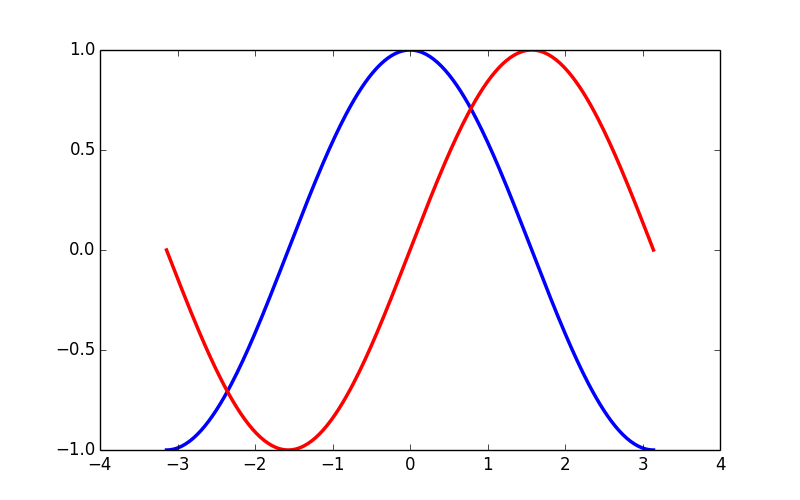

.. hint:: Documentación

   * `Controlando propiedades de línea <http://matplotlib.sourceforge.net/users/pyplot_tutorial.html#controlling-line-properties>`_
   * `API línea <http://matplotlib.sourceforge.net/api/artist_api.html#matplotlib.lines.Line2D>`_

Primer paso, queremos mostrar la función coseno en azul, la función seno en rojo y un
línea ligeramente más gruesa para ambas funciones. También vamos a modificar el tamaño para que sea ligeramente más horizontal.

.. code-block:: python

   ...
   pl.figure(figsize=(10, 6), dpi=80)
   pl.plot(X, C, color="blue", linewidth=2.5, linestyle="-")
   pl.plot(X, S, color="red",  linewidth=2.5, linestyle="-")
   ...

Establecer límites
------------------

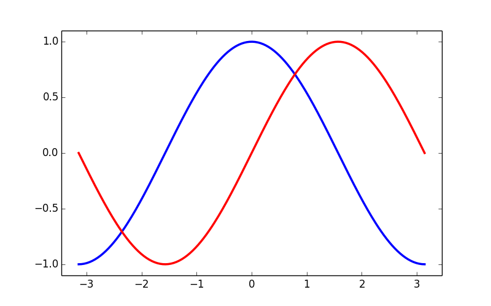

.. hint:: Documentación

   * `Comando xlim() <http://matplotlib.sourceforge.net/api/pyplot_api.html#matplotlib.pyplot.xlim>`_
   * `Comando ylim() <http://matplotlib.sourceforge.net/api/pyplot_api.html#matplotlib.pyplot.ylim>`_

Debido a los límites actuales la figura se muestra un poco ajustada, cambiamos los límites con el fin de ver con claridad todos los puntos.

.. code-block:: python

   ...
   pl.xlim(X.min() * 1.1, X.max() * 1.1)
   pl.ylim(C.min() * 1.1, C.max() * 1.1)
   ...

Configurando graduación de ejes
-------------------------------

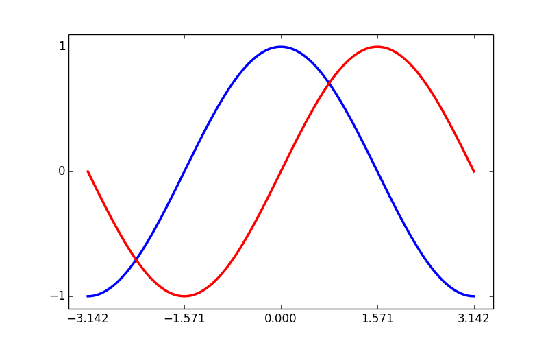

.. hint:: Documentación

   * `Comando xticks() <http://matplotlib.sourceforge.net/api/pyplot_api.html#matplotlib.pyplot.xticks>`_
   * `Comando yticks() <http://matplotlib.sourceforge.net/api/pyplot_api.html#matplotlib.pyplot.yticks>`_
   * `Tick container <http://matplotlib.sourceforge.net/users/artists.html#axis-container>`_
   * `Tick locating and formatting <http://matplotlib.sourceforge.net/api/ticker_api.html>`_

Los graduación actual no es ideal, ya que no muestran los valores requeridos
(+/-π,+/-π/2) para la función seno y la función coseno. Los cambiamos de tal manera que sólo muestren estos valores.

.. code-block:: python

   ...
   pl.xticks([-np.pi, -np.pi/2, 0, np.pi/2, np.pi])
   pl.yticks([-1, 0, +1])
   ...

Configurando etiquetas graduadas
--------------------------------

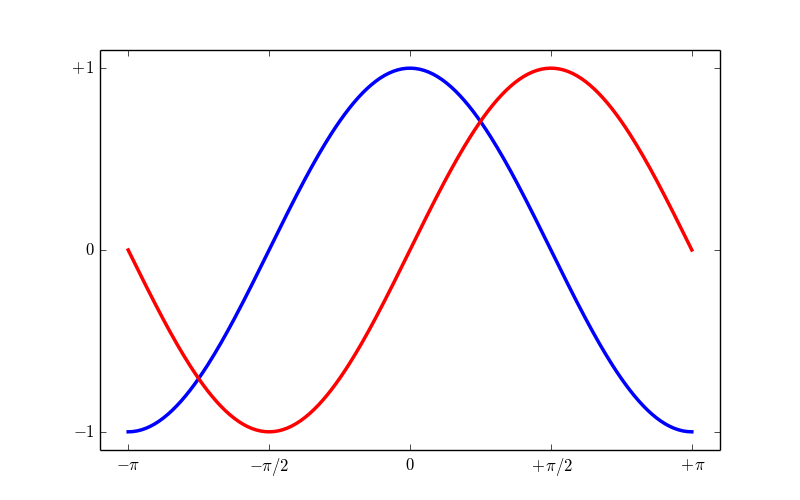

.. hint:: Documentación

   * `Trabajando con texto <http://matplotlib.sourceforge.net/users/index_text.html>`_
   * `Comando xticks() <http://matplotlib.sourceforge.net/api/pyplot_api.html#matplotlib.pyplot.xticks>`_
   * `Comando yticks() <http://matplotlib.sourceforge.net/api/pyplot_api.html#matplotlib.pyplot.yticks>`_
   * `set_xticklabels() <http://matplotlib.sourceforge.net/api/axes_api.html?#matplotlib.axes.Axes.set_xticklabels>`_
   * `set_yticklabels() <http://matplotlib.sourceforge.net/api/axes_api.html?#matplotlib.axes.Axes.set_yticklabels>`_

Las graduaciones están correctamente colocadas, pero su etiqueta no es muy explícita. Podríamos suponer que 3.142 es π pero es mejor hacerlo de forma explícita. Cuando establecemos los valores de graduación, también podemos proporcionar una etiqueta correspondiente en el segundo argumento de la lista. Tenga en cuenta que vamos a utilizar látex para permitir una buena renderización de la etiqueta.

.. code-block:: python

   ...
   pl.xticks([-np.pi, -np.pi/2, 0, np.pi/2, np.pi],
             [r'$-\pi$', r'$-\pi/2$', r'$0$', r'$+\pi/2$', r'$+\pi$'])

   pl.yticks([-1, 0, +1],
             [r'$-1$', r'$0$', r'$+1$'])
   ...

Moviendo spines
---------------

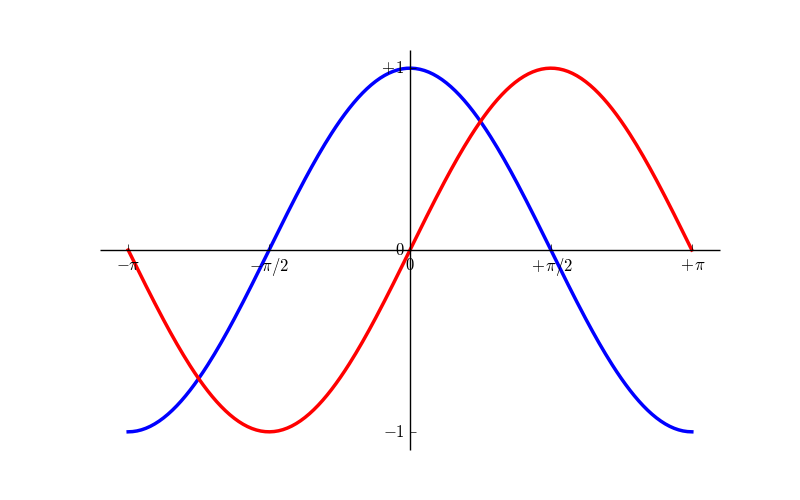

.. hint:: Documentación

   * `Spines <http://matplotlib.sourceforge.net/api/spines_api.html#matplotlib.spines>`_
   * `Axis container <http://matplotlib.sourceforge.net/users/artists.html#axis-container>`_
   * `Transformations tutorial <http://matplotlib.sourceforge.net/users/transforms_tutorial.html>`_

Los spines son las líneas que unen las marcas de graduación del eje y muestran los límites de datos. Se pueden colocar en posiciones arbitrarias, hasta ahora estaban en el borde del eje. Vamos a cambiar eso, ya que queremos tener en el medio. Puesto que hay cuatro de ellos (arriba/abajo/izquierda/derecha), vamos a descartar la parte superior y derecha al establecer su color a ninguno y vamos a mover la parte inferior y la izquierdas para coordinar 0 en las coordenadas de datos.

.. code-block:: python

   ...
   ax = pl.gca()  # gca stands for 'get current axis'
   ax.spines['right'].set_color('none')
   ax.spines['top'].set_color('none')
   ax.xaxis.set_ticks_position('bottom')
   ax.spines['bottom'].set_position(('data',0))
   ax.yaxis.set_ticks_position('left')
   ax.spines['left'].set_position(('data',0))
   ...

Agregando una leyenda
---------------------

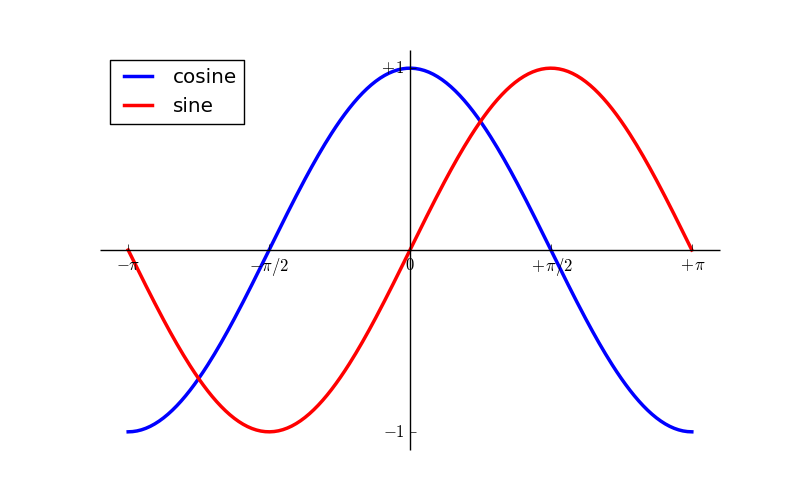

.. hint:: Documentación

   * `Legend guide <http://matplotlib.sourceforge.net/users/legend_guide.html>`_
   * `legend() command <http://matplotlib.sourceforge.net/api/pyplot_api.html#matplotlib.pyplot.legend>`_
   * `Legend API <http://matplotlib.sourceforge.net/api/legend_api.html#matplotlib.legend.Legend>`_

Vamos a añadir una leyenda en la esquina superior izquierda. Esto sólo requiere la adición de la palabra clave label (que se utilizará en el cuadro de la leyenda) en el comando plot.

.. code-block:: python

   ...
   pl.plot(X, C, color="blue", linewidth=2.5, linestyle="-", label="cosine")
   pl.plot(X, S, color="red",  linewidth=2.5, linestyle="-", label="sine")

   pl.legend(loc='upper left')
   ...

Anotaciones en puntos
---------------------

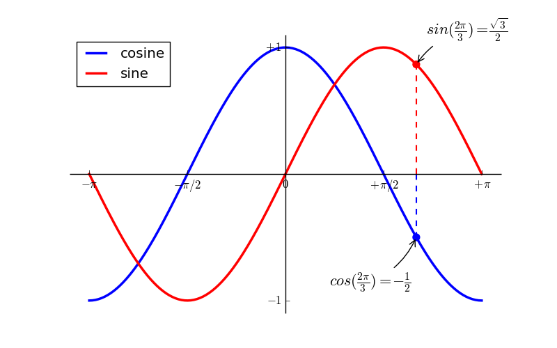

.. hint:: Documentación

   * `Annotating axis <http://matplotlib.sourceforge.net/users/annotations_guide.html>`_
   * `annotate() command <http://matplotlib.sourceforge.net/api/pyplot_api.html#matplotlib.pyplot.annotate>`_

Vamos a anotar algunos puntos interesantes utilizando el comando de annotate. Elegimos el valor 2π/3 y queremos anotar tanto en la función seno y el coseno. Haremos primero
dibujar un marcador en la curva, así como una línea de puntos recta. A continuación, vamos a utilizar el comando annotate que muestra parte del texto con una flecha.

.. code-block:: python

   ...

   t = 2 * np.pi / 3
   pl.plot([t, t], [0, np.cos(t)], color='blue', linewidth=2.5, linestyle="--")
   pl.scatter([t, ], [np.cos(t), ], 50, color='blue')

   pl.annotate(r'$sin(\frac{2\pi}{3})=\frac{\sqrt{3}}{2}$',
               xy=(t, np.sin(t)), xycoords='data',
               xytext=(+10, +30), textcoords='offset points', fontsize=16,
               arrowprops=dict(arrowstyle="->", connectionstyle="arc3,rad=.2"))

   pl.plot([t, t],[0, np.sin(t)], color='red', linewidth=2.5, linestyle="--")
   pl.scatter([t, ],[np.sin(t), ], 50, color='red')

   pl.annotate(r'$cos(\frac{2\pi}{3})=-\frac{1}{2}$',
               xy=(t, np.cos(t)), xycoords='data',
               xytext=(-90, -50), textcoords='offset points', fontsize=16,
               arrowprops=dict(arrowstyle="->", connectionstyle="arc3,rad=.2"))
   ...

Devil is in the details
------------------------

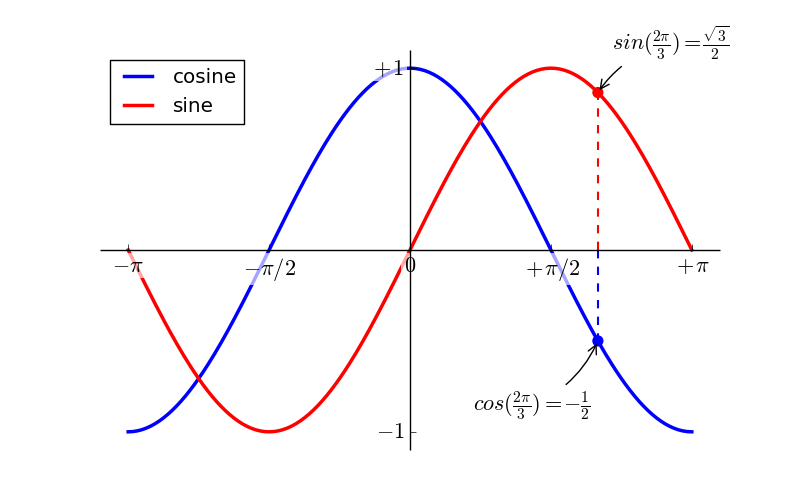

.. hint:: Documentación

   * `Artists <http://matplotlib.sourceforge.net/api/artist_api.html>`_
   * `BBox <http://matplotlib.sourceforge.net/api/artist_api.html#matplotlib.text.Text.set_bbox>`_

Las etiquetas graduadas ahora son apenas visibles debido a las líneas azules y rojas. Podemos hacerlos más grandes y también podemos ajustar sus propiedades, que van a estar
renderizados en un fondo blanco semi-transparente. Esto nos permitirá ver tanto
los datos y las etiquetas.

.. code-block:: python

   ...
   for label in ax.get_xticklabels() + ax.get_yticklabels():
       label.set_fontsize(16)
       label.set_bbox(dict(facecolor='white', edgecolor='None', alpha=0.65))
   ...

Figuras, Subplots, Axes y Ticks
=================================

Hasta ahora hemos utilizado implícitamente la creación de ejes y figuras. Esto es útil para hacer gráficas rápidas. Podemos tener más control sobre la figura, subplots y ejes explícitamente. Una figura en matplotlib significa toda la ventana en la interfaz de usuario. Dentro de esta figura no pueden haber subplots . Mientras que las posiciones de los subplots en una cuadrícula regular, permite la colocación libre de ejes dentro de la figura. Ambos puede ser útiles dependiendo de su intención. Ya hemos trabajado con figuras y subplots sin llamarlos explícitamente. Cuando llamamos a un gráfico, matplotlib llama a gca() para obtener los ejes actuales y gca a su vez llama a gcf() para obtener la figura actual. Si no hay ninguna figure() es llamada para hacer una, hablando estrictamente, se hace un subplot(111). Echemos un vistazo a los detalles.

Figuras
-------

Una figura es una ventana(s) en el GUI con título "Figure #". Las figuras están numeradas a partir de 1, esto es claramente un 'estilo' MATLAB. Existen varios parámetros que determinar que la figura se vea así:

==============  ======================= ==============================================
Argumento       Por defecto             Descripción
==============  ======================= ==============================================
num             1                       número de figura
figsize         figure.figsize          tamaño de figura en pulgadas (ancho, alto)
dpi             figure.dpi              resolución en puntos por pulgada
facecolor       figure.facecolor        color de fondo del dibujo
edgecolor       figure.edgecolor        color del borde alrededor del fondo del dibujo
frameon         True                    dibujar figura en marcos o no
==============  ======================= ==============================================

Los valores por defecto se pueden especificar en el archivo de recursos y se utilizará la mayor parte del tiempo. Sólo el número de la figura se cambia con frecuencia.

Cuando se trabaja con la interfaz gráfica de usuario se puede cerrar una figura haciendo clic en la X de la esquina superior derecha. Sin embargo, se puede cerrar una figura llamando a close. Según el argumento para cerrar (1) la figura actual (sin argumento) , (2) una figura específica (número de la figura o instancia de figura es argumento ), o (3) todas las figuras (all es argumento).

Al igual que con otros objetos, también se puede establecer las propiedades de la figura con setp o con el método set_something.

Subplots
--------

Con subplot puede organizar gráficas en una cuadrícula regular. Es necesario especificar el número de filas, columnas y el número del gráfico. Tenga en cuenta que el comando `gridspec <http://matplotlib.sourceforge.net/users/gridspec.html>`_ es una alternativa más poderosa.

.. image:: auto_examples/images/plot_subplot-horizontal_1.png
   :scale: 28
   :target: auto_examples/plot_subplot-horizontal.html
.. image:: auto_examples/images/plot_subplot-vertical_1.png
   :scale: 28
   :target: auto_examples/plot_subplot-vertical.html
.. image:: auto_examples/images/plot_subplot-grid_1.png
   :scale: 28
   :target: auto_examples/plot_subplot-grid.html
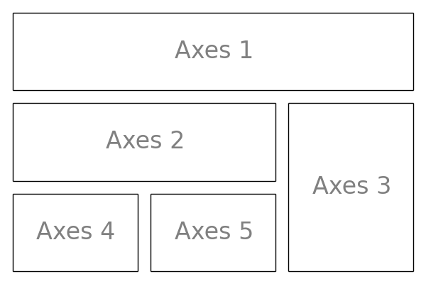

Ejes (axes)
-----------

Los ejes son muy similares a los subplots, permiten colocar gráficos en cualquier ubicación en la figura. Así que si queremos poner un gráfico pequeño dentro de uno más grande con los mismos ejes.

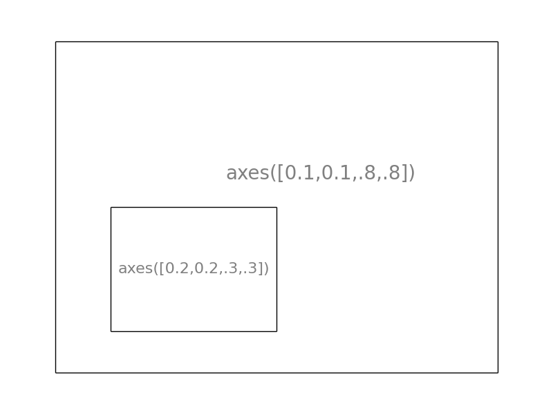
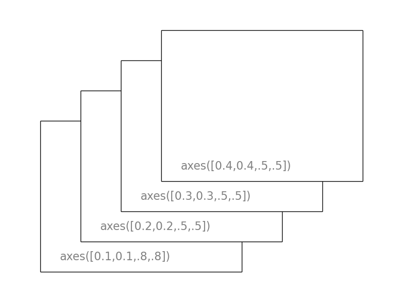

Graduaciones (ticks)
--------------------

Las graduaciones con formato son una parte importante de los gráficos listos para publicar. Matplotlib ofrece un sistema totalmente configurable para graduaciones. Hay
graduaciones localizadoras para especificar dónde deben aparecer las graduaciones y graduaciones con formato para dar el aspecto que desea a las graduaciones. Las graduaciones mayores y menores puede ser localizadas y formateadas de forma independiente el uno del otro. Por defecto no se muestra la graduación menor,
es decir, sólo hay una lista vacía de ellos, ya que estan con NullLocator (ver
a continuación).

Localizadoras de graduación (tick locators)
...........................................

Las localizadoras de graduación controlan las posiciones de las graduaciones. Ellas se establecen como

.. code-block:: python

   ax = pl.gca()
   ax.xaxis.set_major_locator(eval(locator))

Hay varios localizadores para diferentes tipos de requerimientos:

.. image:: auto_examples/images/plot_ticks_1.png
   :scale: 60
   :target: auto_examples/plot_ticks.html

Todos estos localizadores derivan de la clase base matplotlib.ticker.Locator.
Usted puede hacer su propio localizador derivandola de la clase base. Manipulación de fechas con graduaciones puede ser especialmente difícil. Por lo tanto, matplotlib proporciona localizadores especiales en matplotlib.dates.

Otros tipos de gráficos: ejemplos y ejercicios
==============================================

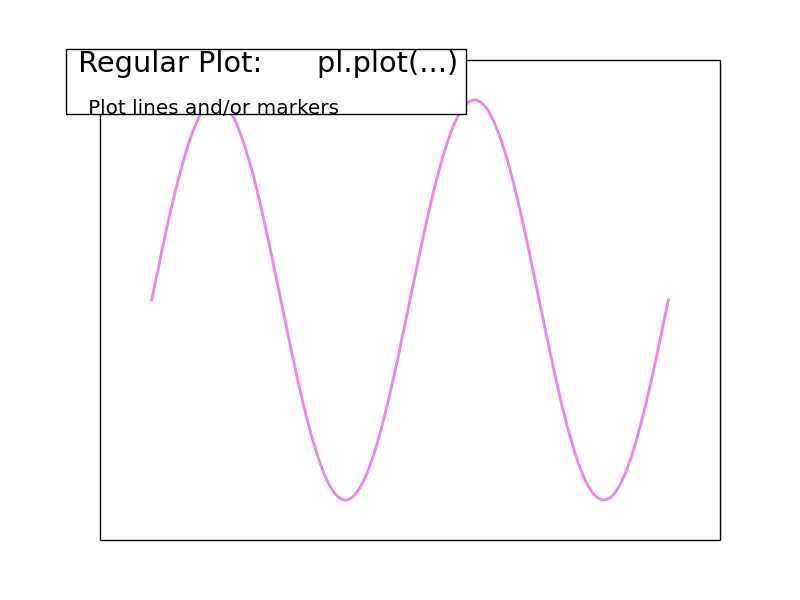
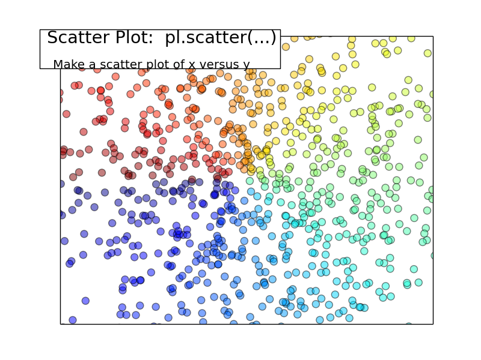
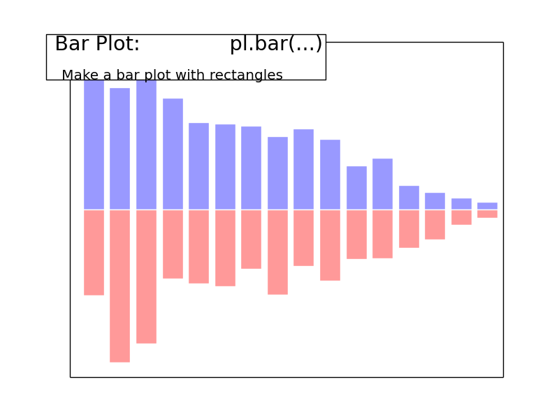
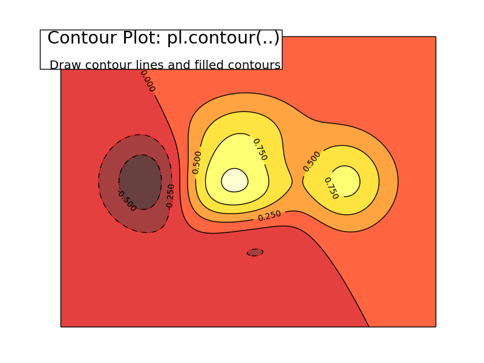
.. image:: auto_examples/images/plot_imshow_1.png
   :scale: 39
   :target: `Imshow`_
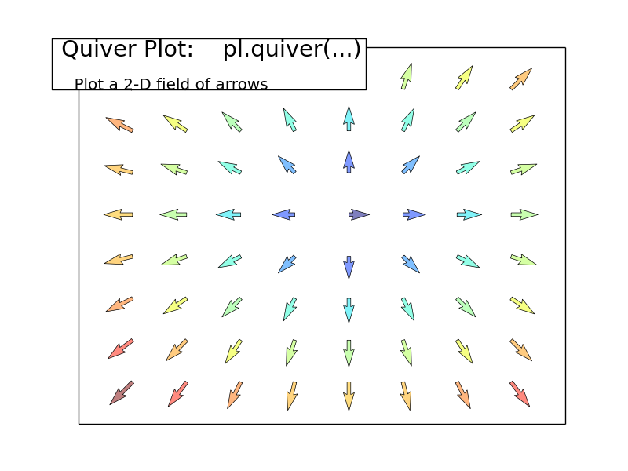
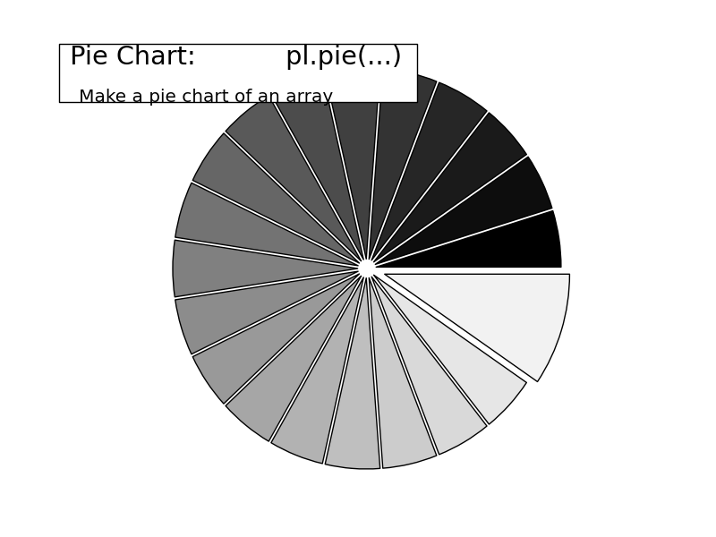
.. image:: auto_examples/images/plot_grid_1.png
   :scale: 39
   :target: `Grids`_
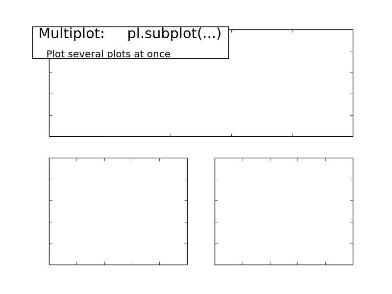
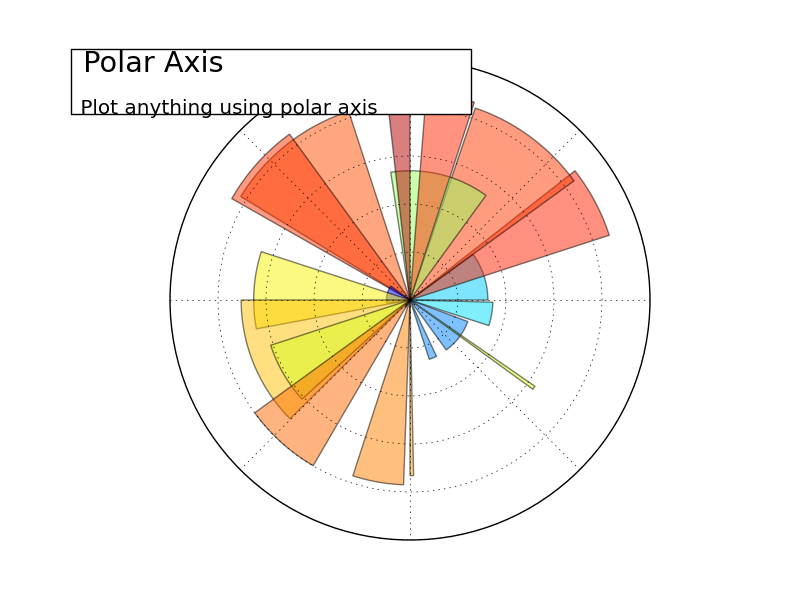

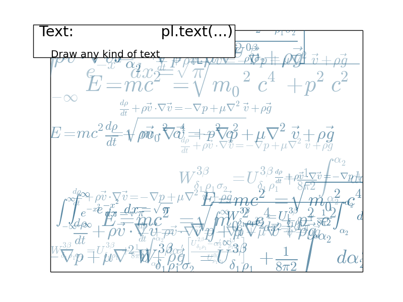

Gráficos regulares
------------------

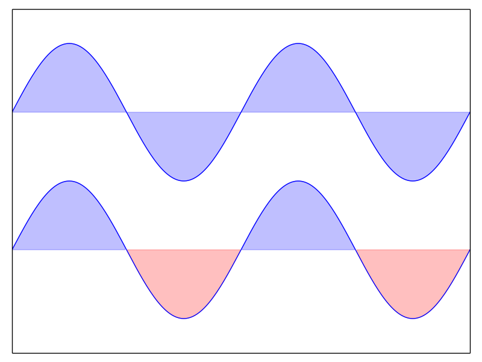

.. hint:: Es necesario utilizar el comando `fill_between <http://matplotlib.sourceforge.net/api/pyplot_api.html#matplotlib.pyplot.fill_between>`_.

A partir del código de abajo, trate de reproducir el gráfico en forma correcta
tomando en cuenta las zonas rellenadas

.. code-block:: python

   n = 256
   X = np.linspace(-np.pi, np.pi, n, endpoint=True)
   Y = np.sin(2 * X)

   pl.plot(X, Y + 1, color='blue', alpha=1.00)
   pl.plot(X, Y - 1, color='blue', alpha=1.00)

Haga clic en la figura para la solución.

Gráficos de dispersión (scatter)
--------------------------------

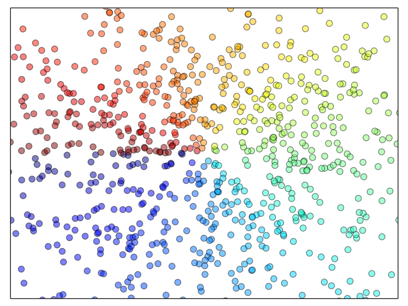

.. hint:: Color está dado por el ángulo de (X, Y).

A partir del código de abajo, trate de reproducir el gráfico en forma correcta
tomando en cuenta el tamaño de marcas, el color y la transparencia.

.. code-block:: python

   n = 1024
   X = np.random.normal(0,1,n)
   Y = np.random.normal(0,1,n)

   pl.scatter(X,Y)

Haga clic en la figura para la solución.

Gráfico de barras (bar)
-----------------------

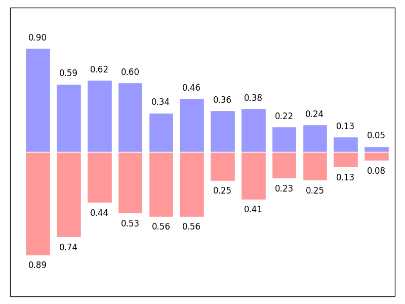

.. hint:: Tomar en cuenta la alineación del texto.

A partir del código de abajo, trate de reproducir el gráfico en forma correcta
agregando etiquetas en las barras rojas.

.. code-block:: python

   n = 12
   X = np.arange(n)
   Y1 = (1 - X / float(n)) * np.random.uniform(0.5, 1.0, n)
   Y2 = (1 - X / float(n)) * np.random.uniform(0.5, 1.0, n)

   pl.bar(X, +Y1, facecolor='#9999ff', edgecolor='white')
   pl.bar(X, -Y2, facecolor='#ff9999', edgecolor='white')

   for x, y in zip(X, Y1):
       pl.text(x + 0.4, y + 0.05, '%.2f' % y, ha='center', va='bottom')

   pl.ylim(-1.25, +1.25)

Haga clic en la figura para la solución.

Gráficos de contorno
--------------------

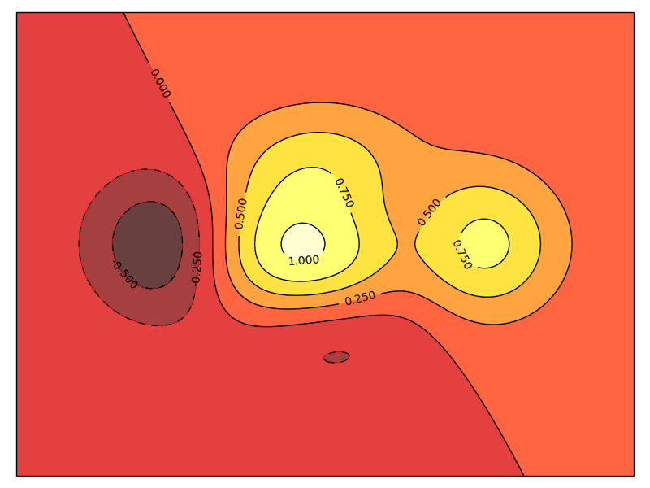

.. hint:: Es necesario utilizar el comando `clabel <http://matplotlib.sourceforge.net/api/pyplot_api.html#matplotlib.pyplot.clabel>`_.

A partir del código de abajo, trate de reproducir el gráfico en forma correcta
tomando en cuneta el colormap (ver `Colormaps`_ más abajo).

.. code-block:: python

   def f(x, y):
       return (1 - x / 2 + x ** 5 + y ** 3) * np.exp(-x ** 2 -y ** 2)

   n = 256
   x = np.linspace(-3, 3, n)
   y = np.linspace(-3, 3, n)
   X, Y = np.meshgrid(x, y)

   pl.contourf(X, Y, f(X, Y), 8, alpha=.75, cmap='jet')
   C = pl.contour(X, Y, f(X, Y), 8, colors='black', linewidth=.5)

Haga clic en la figura para la solución.

Imshow
------

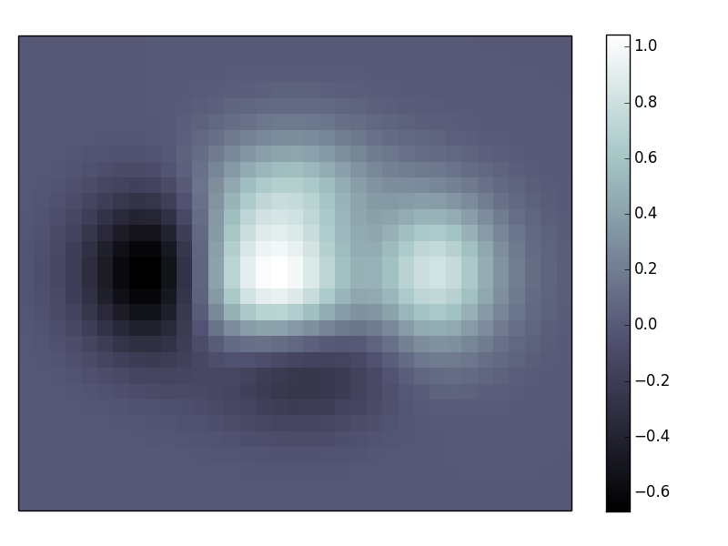

.. hint:: Necesita tomar en cuenta el ``origin`` de la imagen en el comando imshow y usar un `colorbar <http://matplotlib.sourceforge.net/api/pyplot_api.html#matplotlib.pyplot.colorbar>`_.

A partir del código de abajo, trate de reproducir el gráfico en forma correcta
teniendo en cuenta el colormap, interpolación de imágenes y el origen.

.. code-block:: python

   def f(x, y):
       return (1 - x / 2 + x ** 5 + y ** 3) * np.exp(-x ** 2 - y ** 2)

   n = 10
   x = np.linspace(-3, 3, 4 * n)
   y = np.linspace(-3, 3, 3 * n)
   X, Y = np.meshgrid(x, y)
   pl.imshow(f(X, Y))

Haga clic en la figura para la solución.

Pie Charts
----------

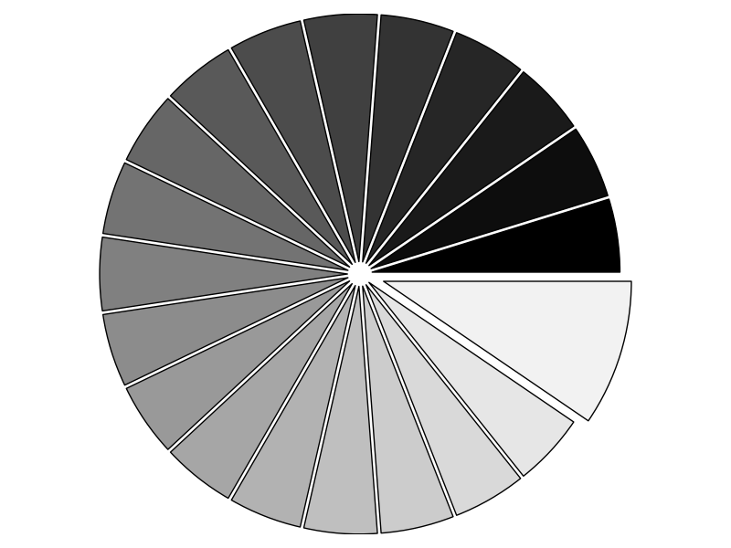

.. hint:: Debe modificar Z.

A partir del código de abajo, trate de reproducir el gráfico en forma correcta
tomando en cuenta los colores y el tamaño de divisiones.

.. code-block:: python

   Z = np.random.uniform(0, 1, 20)
   pl.pie(Z)

Haga clic en la figura para la solución.

Quiver Plots
------------

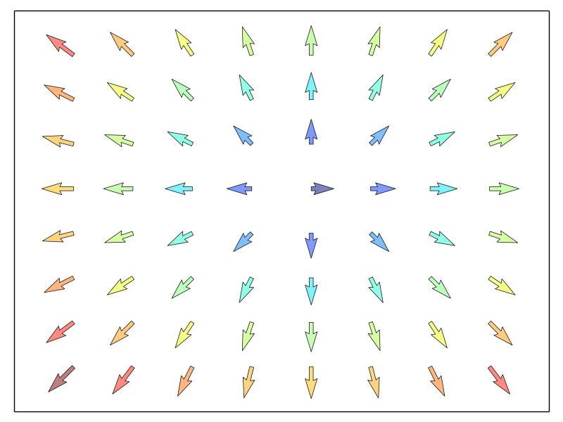

.. hint:: Tienes que dibujar las flechas dos veces.

A partir del código anterior, intente reproducir el gráfico en la toma correcta
tomando en cuenta los colores y direcciones.

.. code-block:: python

   n = 8
   X, Y = np.mgrid[0:n, 0:n]
   pl.quiver(X, Y)

Haga clic en la figura para la solución.

Cuadrículas (grids)
-------------------

.. image:: auto_examples/images/plot_grid_ex_1.png
   :align: right
   :scale: 35
   :target: auto_examples/plot_grid_ex.html

A partir del código anterior, intente reproducir el gráfico en la toma correcta
tomando en cuenta los estilos de línea.

.. code-block:: python

   axes = pl.gca()
   axes.set_xlim(0, 4)
   axes.set_ylim(0, 3)
   axes.set_xticklabels([])
   axes.set_yticklabels([])

Haga clic en la figura para la solución.

Gráficos múltiples
------------------

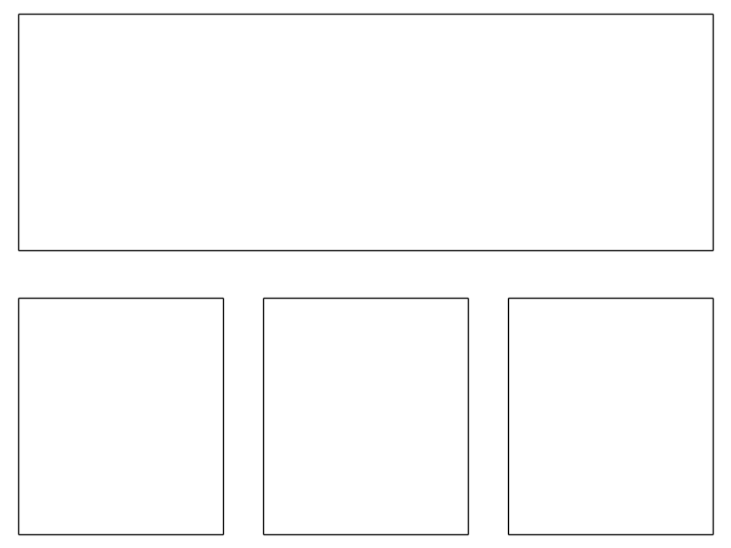

.. hint:: Puede utilizar varios subplots con diferentes particiones.

A partir del código de abajo, intente reproducir el gráfico de la derecha.

.. code-block:: python

   pl.subplot(2, 2, 1)
   pl.subplot(2, 2, 3)
   pl.subplot(2, 2, 4)

Haga clic en la figura para la solución.

Ejes polares
------------

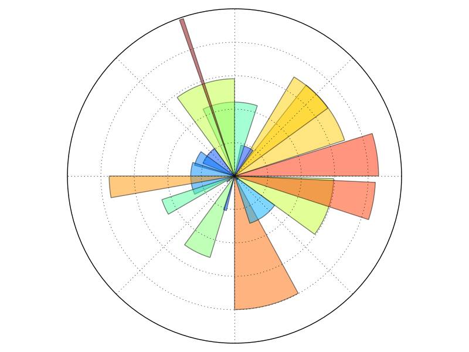

.. hint:: Tiene que modificar la línea ``axes``

A partir del código de abajo, intente reproducir el gráfico de la derecha.

.. code-block:: python

   pl.axes([0, 0, 1, 1])

   N = 20
   theta = np.arange(0., 2 * np.pi, 2 * np.pi / N)
   radii = 10 * np.random.rand(N)
   width = np.pi / 4 * np.random.rand(N)
   bars = pl.bar(theta, radii, width=width, bottom=0.0)

   for r, bar in zip(radii, bars):
       bar.set_facecolor(cm.jet(r / 10.))
       bar.set_alpha(0.5)

Haga clic en la figura para la solución.

Gráficos 3D
-----------

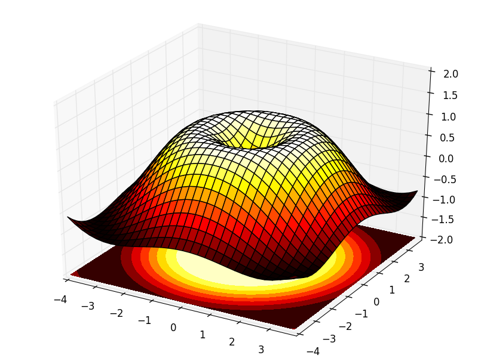

.. hint:: Debe usar `contourf <http://matplotlib.sourceforge.net/api/pyplot_api.html#matplotlib.pyplot.contourf>`_

A partir del código de abajo, intente reproducir el gráfico de la derecha.

.. code-block:: python

   from mpl_toolkits.mplot3d import Axes3D

   fig = pl.figure()
   ax = Axes3D(fig)
   X = np.arange(-4, 4, 0.25)
   Y = np.arange(-4, 4, 0.25)
   X, Y = np.meshgrid(X, Y)
   R = np.sqrt(X**2 + Y**2)
   Z = np.sin(R)

   ax.plot_surface(X, Y, Z, rstride=1, cstride=1, cmap='hot')

Haga clic en la figura para la solución.

.. seealso:: :ref:`mayavi-label`

Texto
-----

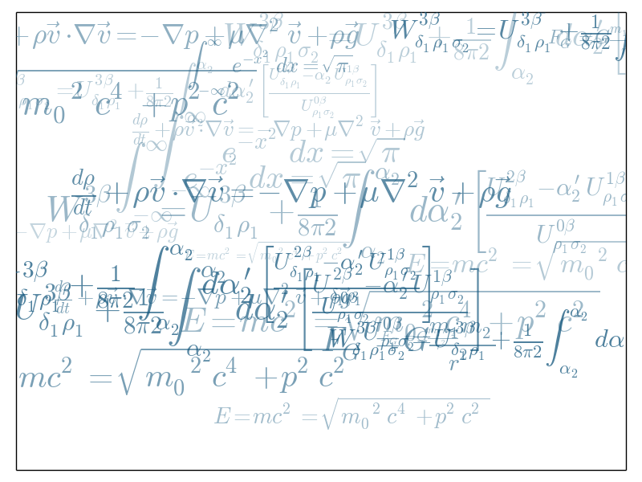

.. hint:: Echa un vistazo a `matplotlib logo <http://matplotlib.sourceforge.net/examples/api/logo2.html>`_.

Trate de hacer lo mismo desde el principio !

Haga clic en la figura para la solución.

Más allá de este tutorial
=========================

Matplotlib esta beneficiada con una extensa documentación, así como una gran
comunidad de usuarios y desarrolladores. Estos son algunos enlaces de interés:

Tutoriales
----------

.. hlist::

  * `Pyplot tutorial <http://matplotlib.sourceforge.net/users/pyplot_tutorial.html>`_

    - Introduction
    - Controlling line properties
    - Working with multiple figures and axes
    - Working with text

  * `Image tutorial <http://matplotlib.sourceforge.net/users/image_tutorial.html>`_

    - Startup commands
    - Importing image data into Numpy arrays
    - Plotting numpy arrays as images

  * `Text tutorial <http://matplotlib.sourceforge.net/users/index_text.html>`_

    - Text introduction
    - Basic text commands
    - Text properties and layout
    - Writing mathematical expressions
    - Text rendering With LaTeX
    - Annotating text

  * `Artist tutorial <http://matplotlib.sourceforge.net/users/artists.html>`_

    - Introduction
    - Customizing your objects
    - Object containers
    - Figure container
    - Axes container
    - Axis containers
    - Tick containers

  * `Path tutorial <http://matplotlib.sourceforge.net/users/path_tutorial.html>`_

    - Introduction
    - Bézier example
    - Compound paths

  * `Transforms tutorial <http://matplotlib.sourceforge.net/users/transforms_tutorial.html>`_

    - Introduction
    - Data coordinates
    - Axes coordinates
    - Blended transformations
    - Using offset transforms to create a shadow effect
    - The transformation pipeline

Documentación Matplotlib
------------------------

* `User guide <http://matplotlib.sourceforge.net/users/index.html>`_

* `FAQ <http://matplotlib.sourceforge.net/faq/index.html>`_

  - Installation
  - Usage
  - How-To
  - Troubleshooting
  - Environment Variables

* `Screenshots <http://matplotlib.sourceforge.net/users/screenshots.html>`_

Código de documentación
-----------------------

El código está bien documentado y se puede acceder rápidamente a un comando específico
dentro una sesión de python:

.. code-block:: python

   >>> import pylab as pl
   >>> help(pl.plot)
   Help on function plot in module matplotlib.pyplot:

   plot(*args, **kwargs)
      Plot lines and/or markers to the
      :class:`~matplotlib.axes.Axes`.  *args* is a variable length
      argument, allowing for multiple *x*, *y* pairs with an
      optional format string.  For example, each of the following is
      legal::
    
          plot(x, y)         # plot x and y using default line style and color
          plot(x, y, 'bo')   # plot x and y using blue circle markers
          plot(y)            # plot y using x as index array 0..N-1
          plot(y, 'r+')      # ditto, but with red plusses
    
      If *x* and/or *y* is 2-dimensional, then the corresponding columns
      will be plotted.
      ...

Galerías
---------

La `galería matplotlib <http://matplotlib.sourceforge.net/gallery.html>`_ es
muy útil cuando se busca la manera de hacer un gráfico dado. Cada
ejemplo viene con su código fuente.

Una galería más pequeña está disponible `aquí <http://www.loria.fr/~rougier/coding/gallery/>`_.

Lista de correos
----------------

Por último, hay una `lista de correo de usuarios
<https://lists.sourceforge.net/lists/listinfo/matplotlib-users>`_ donde se puede
pedir ayuda y una `lista de correo de desarrolladores
<https://lists.sourceforge.net/lists/listinfo/matplotlib-devel>`_ que es más
técnica.

Referencias rápidas
===================

Aquí hay una serie de cuadros que muestran las propiedades y estilos principales.

Propiedades de Línea
--------------------

.. list-table::
   :widths: 20 30 50
   :header-rows: 1

   * - Propiedad
     - Descripción
     - Apariencia

   * - alpha (o a)
     - transparencia alpha en escala 0-1
     - .. image:: auto_examples/images/plot_alpha_1.png

   * - antialiased
     - True o False - usar renderizado suavizado
     - .. image:: auto_examples/images/plot_aliased_1.png
       .. image:: auto_examples/images/plot_antialiased_1.png

   * - color (or c)
     - matplotlib color arg
     - .. image:: auto_examples/images/plot_color_1.png

   * - linestyle (o ls)
     - ver `Line properties`_
     -

   * - linewidth (o lw)
     - float, the line width in points
     - .. image:: auto_examples/images/plot_linewidth_1.png

   * - solid_capstyle
     - Cap style for solid lines
     - .. image:: auto_examples/images/plot_solid_capstyle_1.png

   * - solid_joinstyle
     - Join style for solid lines
     - .. image:: auto_examples/images/plot_solid_joinstyle_1.png

   * - dash_capstyle
     - Cap style for dashes
     - .. image:: auto_examples/images/plot_dash_capstyle_1.png

   * - dash_joinstyle
     - Join style for dashes
     - .. image:: auto_examples/images/plot_dash_joinstyle_1.png

   * - marker
     - see `Markers`_
     -

   * - markeredgewidth (mew)
     - line width around the marker symbol
     - .. image:: auto_examples/images/plot_mew_1.png

   * - markeredgecolor (mec)
     - edge color if a marker is used
     - .. image:: auto_examples/images/plot_mec_1.png

   * - markerfacecolor (mfc)
     - face color if a marker is used
     - .. image:: auto_examples/images/plot_mfc_1.png

   * - markersize (ms)
     - size of the marker in points
     - .. image:: auto_examples/images/plot_ms_1.png

Estilos de línea
----------------

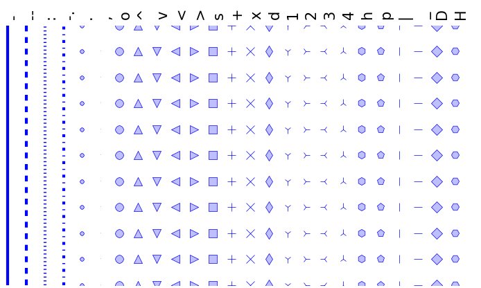

Marcadores
----------

.. image:: auto_examples/images/plot_markers_1.png

Colormaps
---------

Todos los colormaps pueden invertirse añadiendo ``_r``. Por ejemplo, ``gray_r`` es
el inverso de ``gray``.

Si desea saber más acerca de colormaps, revise `Documenting the matplotlib
colormaps <https://gist.github.com/2719900>`_.

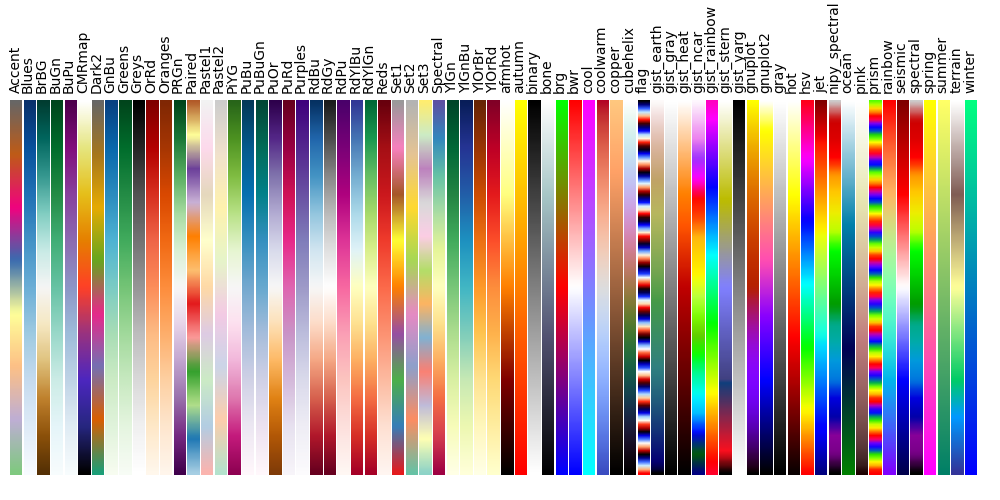

